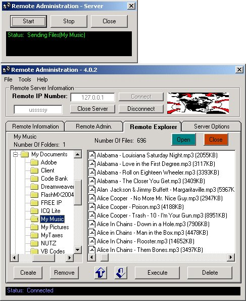



## Remote Administration

### Description

Administer a remote computer via LAN/WAN/Dial-Up. Code is complete with no bugs (that I'm aware of.) The server comes complete with an "options" form that can be accessed by right clicking the server icon in the system tray. There's just WAY TOO MUCH for me to even begin to explain what all it does ... view the screen shot about the remote explorer. I don't care if you vote, but PLEASE comment. This is definitely not an original idea, but I believe it's one of the better ones. (BTW TY to all the authors who have helped me with my code and suggestions.)

*** 6/9/04 ***

PROGRAM COMPLETED
 
### More Info
 

             |
---                |---
**Submitted On**   |2004-06-12 08:31:48
**By**             |[AJ Trahan](https://github.com/Planet-Source-Code/PSCIndex/blob/master/ByAuthor/aj-trahan.md)
**Level**          |Advanced
**User Rating**    |4.9 (64 globes from 13 users)
**Compatibility**  |VB 6\.0
**Category**       |[Complete Applications](https://github.com/Planet-Source-Code/PSCIndex/blob/master/ByCategory/complete-applications__1-27.md)
**World**          |[Visual Basic](https://github.com/Planet-Source-Code/PSCIndex/blob/master/ByWorld/visual-basic.md)
**Archive File**   |[Remote\_Adm1756516122004\.zip](https://github.com/Planet-Source-Code/aj-trahan-remote-administration__1-54071/archive/master.zip)

